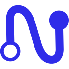
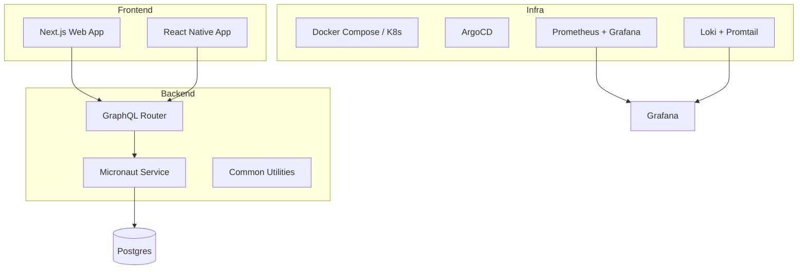
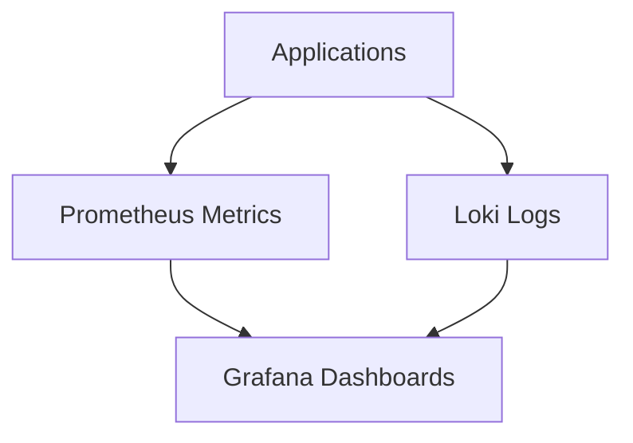

<p align="center">
  
</p>

# NeoTool — build smarter, not harder


---

NeoTool is a **modular full‑stack boilerplate** designed to **accelerate new app development** while keeping **clean architecture and best practices** baked in from day one.

Think of it as a **foundation framework** that helps you spin up new services or apps (backend, frontend, infra, and design system) — all wired together and ready to evolve.

---

## ✨ Overview

NeoTool brings together several layers under one monorepo:

| Layer | Description | Tech Stack |
|-------|--------------|-------------|
| **Backend (`service/`)** | Kotlin + Micronaut with GraphQL, modular architecture, reusable components, and testing setup. | Kotlin, Micronaut, GraphQL, Gradle |
| **Frontend (`web/`)** | React + Next.js web app scaffold ready to consume GraphQL APIs. | React, Next.js, TypeScript |
| **Mobile (`mobile/`)** | Expo + React Native setup for cross‑platform mobile apps. | React Native, Expo |
| **Infra (`infra/`)** | Docker Compose, Kubernetes (Kustomize), GitOps (ArgoCD), and observability stack. | Docker, K8s, Grafana, Prometheus, Loki |
| **Contracts (`contracts/`)** | GraphQL Federation + OpenAPI specs for schema standardization. | Apollo Federation, OpenAPI |
| **Design (`design/`)** | Brand assets, UI tokens, icons, and design guidelines. | Figma, Adobe, Tokens |
| **Docs (`docs/`)** | ADRs and developer documentation via Docusaurus. | Markdown, Docusaurus |

---

## 🧩 Architecture



---

## ⚙️ Architectural Decisions

NeoTool is opinionated on purpose — it enforces a structure that scales.

### Modular Kotlin backend
- **Micronaut** chosen for AOT, speed, and low memory footprint.
- Follows **domain-driven design** (API → Service → Repo → Entity).

### GraphQL everywhere
- Unified contracts and schema federation for multi-service setups.
- Better developer experience (DX) than traditional REST.

### Design system & contracts
- Shared assets and schemas across frontend + backend = no drift.
- Easier to build cohesive UI and API experiences.

### Infra that just works
- Local development via Docker Compose.  
- Cloud-ready via K8s + ArgoCD GitOps.  
- Observability stack built in (Prometheus, Grafana, Loki).


### Why we’re not using cloud-specific Serverless (for now)

NeoTool was designed to run **natively on Docker/K8s**, both locally and in the cloud, **keeping it vendor-neutral**.

While Serverless offerings (like AWS Lambda, GCP Cloud Functions, or Azure Functions) can be great for some workloads, we chose **not to make them the default**.

#### The rationale
- 🧭 **Portability & vendor freedom** — Keeping everything in containers avoids lock-in and allows multi-cloud.
- 🧠 **Cloud environments can get complex fast** — Real-world cloud setups often combine dozens of managed services (functions, queues, secrets, policies, gateways, etc.), which makes reproducing and testing them locally painful.  
- 💼 **Predictable costs** — For long-running or steady workloads, container billing is simpler and more predictable than per-invocation pricing.
- 🔗 **Network control** — Accessing VPCs, databases, or internal APIs is usually simpler and faster in containers than within serverless boundaries.

#### Trade-offs
- ⚡ **Auto-scaling per request** — FaaS can scale instantly per event; in K8s you fine-tune via HPA/VPA.
- 🧊 **Zero idle cost** — Functions don’t consume resources when idle; containers always reserve a bit.
- ⚙️ **Managed ops** — In FaaS, OS/runtime patching is invisible; in K8s you own the base image lifecycle.
- ⏱️ **Time-to-first-request** — FaaS can have cold starts; Micronaut minimizes that, but warm containers are still more predictable.

#### When to reconsider Serverless
- **Event-driven jobs** — isolated pipelines, short tasks, or lightweight workers triggered by events.
- **Spiky workloads** — endpoints with unpredictable traffic that tolerate cold starts.
- **ETL/batch triggers** — short jobs launched by uploads, queues, or scheduled triggers.
- **Glue logic** — small connectors between SaaS services with minimal state.

#### Middle-ground options
- **Serverless containers** (e.g., Cloud Run, App Runner): keep Docker artifacts but gain aggressive auto-scaling and low idle cost.
- **Hybrid by domain**: core services stay in K8s; glue or event functions live in FaaS.

#### Design choice impact on NeoTool
- 🔒 **Less lock-in** — same IaC and GitOps pipelines across environments.
- 🧰 **First-class observability** — Prometheus, Grafana, Loki work out of the box.
- 🧱 **Solid patterns** — 12-factor apps, stateless containers, env configs, health/readiness probes.
- 🚀 **Future-ready** — Micronaut already supports low cold-start latency; moving selective workloads to FaaS later will be incremental, not a rewrite.

> TL;DR — We start with Docker/K8s for **portability, predictability, and developer velocity**.  
> Serverless remains on the roadmap as a **tactical tool** for event-driven or bursty workloads where it truly makes sense.


### Database

NeoTool ships with **PostgreSQL** as its default database.

PostgreSQL has evolved into a powerful **hybrid SQL + JSONB engine** that covers most NoSQL use-cases while keeping strong consistency and relational integrity.

#### Why PostgreSQL
- 🧱 **Schema evolution made sane** — migrations (Flyway) + typed queries keep data and code aligned.  
- 🪶 **JSONB flexibility** — store unstructured data without giving up SQL joins or indexing.  
- ⚡ **Powerful indexing & query planner** — GIN/GIST indexes, parallel execution, and cost-based optimization.  
- 🔒 **ACID & transactional safety** — perfect for financial or enterprise-grade workloads.  
- 🌍 **Ecosystem maturity** — battle-tested with rich tooling (pgAdmin, psql, pgvector, etc.).  
- 💾 **Integration ready** — works smoothly with ORM-less frameworks (like Micronaut Data).

#### Why not NoSQL
- While NoSQL options (MongoDB, DynamoDB, etc.) shine for **massive horizontal scalability** and **unstructured, schema-free data**, they usually sacrifice:
  - transaction consistency (eventual instead of strong),
  - rich relational queries,
  - and complex joins across entities.
  
  NeoTool focuses on **consistency, simplicity, and developer velocity**, so PostgreSQL wins by default
  
PostgreSQL covers most of cases, but nothing stops you from plugging in a NoSQL module if needed, especially if your data is not strong structured or can increased massively.


### Service Stack

NeoTool is language-agnostic and can host **multiple microservices in any language**.  
Still, our default template is **Kotlin + Micronaut**, on purpose.

#### Why Kotlin + Micronaut
- ⚡ **Fast startup & low memory** — DI and AOP are computed at compile time (not reflection heavy), which means snappy startup and small footprints in Docker/K8s.
- 🧠 **Modern, safe language** — Kotlin’s null-safety, data classes, sealed types, and coroutines reduce entire classes of bugs and simplify async flows.
- 🚀 **Cloud-native fit** — Works great in containers, scales with HPA, and is friendly to serverless/native-image builds when needed.
- 🧩 **Modular architecture** — Micronaut encourages small, testable modules (HTTP, GraphQL, Data, Validation, Security), aligning perfectly with NeoTool’s “compose & reuse” philosophy.
- 🔧 **Developer experience** — Clear annotations, first-class validation, and Micronaut Data for concise repositories without heavy ORMs.
- 📈 **Observability by default** — Micrometer, HTTP filters/interceptors, and log context (MDC) integrate cleanly with Prometheus/Grafana/Loki.
- 🧪 **Testing that scales** — Fast integration tests (Testcontainers), plus a clean separation of unit vs. integration layers.

#### Problems this choice solves (out of the box)
- **Cold start & resource constraints**: services boot quick and stay lean — ideal for dense clusters and CI ephemeral envs.
- **Reliability & safety**: Kotlin’s type system + validation reduce runtime surprises for API and GraphQL resolvers.
- **Consistency across services**: common modules (logging, errors, GraphQL wiring, DTO validation) keep conventions uniform.
- **Operational clarity**: structured logs + metrics + health checks are standard, not add-ons.
- **Evolvability**: compile-time DI/AOP and modular packages keep refactors predictable as the codebase


### Web Stack

NeoTool’s frontend is powered by **TypeScript**, **React**, and **Next.js** — a stack built for performance, scalability, and type safety.

#### Why this stack
- ⚡ **TypeScript-first** — strict typing across components and GraphQL schemas ensures confidence during refactors and keeps the frontend in sync with the API.  
- 🧭 **Next.js (App Router)** — modern architecture with hybrid rendering (SSR, SSG, ISR), edge runtimes, and built-in routing, caching, and internationalization.  
- 🎨 **Design-system ready** — component-driven UI with shared tokens (MUI + Storybook support) keeps design and engineering aligned.  
- 🔁 **Tight backend integration** — GraphQL codegen enforces type safety and prevents schema drift.  
- 🧱 **Consistent environments** — same setup locally and in Docker/K8s — no “works on my machine” issues.

#### Strengths
- 🚀 **Performance out of the box** — hybrid rendering + smart caching for fast TTFB and SEO-friendly pages.  
- 🧠 **Developer velocity** — opinionated conventions, hot reload, and unified tooling reduce cognitive load.  
- 🔗 **Scalable architecture** — modular layouts, async data loading, and server/client component boundaries make it easy to grow the app cleanly.

> **TL;DR** — Next.js with TypeScript and React gives NeoTool a **future-proof, high-performance frontend foundation**, fast to iterate, easy to scale, and built with strong type guarantees.


---

## 🚀 Getting Started

### 1. Prerequisites
Make sure you have:
- Docker + Docker Compose
- Node.js v20+ and `pnpm`
- JDK 21+
- Gradle 8+

### 2. Run locally

```bash
# Spin up infra stack (DB, Grafana, Prometheus, Loki)
docker-compose -f infra/docker/docker-compose.local.yml up -d

# Start backend
cd service/kotlin/app
./gradlew run

# Start frontend web
cd web
pnpm install
pnpm dev

# Start mobile app
cd mobile
pnpm install
pnpm start
```

Access the services:
- **GraphQL Router** → [http://localhost:4000/graphql](http://localhost:4000/graphql)  
- **Web App** → [http://localhost:3000](http://localhost:3000)  
- **Grafana Dashboard** → [http://localhost:3001](http://localhost:3001) (default credentials: `admin/admin`)  
- **Prometheus** → [http://localhost:9090](http://localhost:9090)  
- **Loki Logs** → [http://localhost:3100](http://localhost:3100)
- **Expo** → via QR code

---

## 📊 Observability Stack



Files:
- `infra/observability/prometheus/prometheus.yml`
- `infra/observability/grafana/`
- `infra/observability/loki/`
- `infra/observability/promtail/`

---

## 🧱 Folder Structure (High Level)

```bash
neotool/
├── service/        # Kotlin backend modules (gateway, common, app)
├── web/            # Web frontend (Next.js)
├── mobile/         # Mobile app (React Native / Expo)
├── infra/          # Docker, K8s, GitOps, observability
├── contracts/      # GraphQL + OpenAPI contracts
├── design/         # Brand assets & design system
├── docs/           # ADRs and docs site
└── README.md
```

---

## 🧭 Roadmap

- [ ] Lint
- [ ] Add Security module (Auth, RBAC)
- [ ] Enable K8s deploy via GitOps  
- [ ] AI-based documentation assistant 🤖

---

## 🤝 Contributing

Pull requests, issues, and ideas are super welcome!  
Just keep the structure clean and consistent with existing modules.

---

## 📜 License

**Custom Non‑Commercial License (based on MIT + Commons Clause)**  
You’re free to use, modify, and extend NeoTool for your own or your company’s applications.  
You **can’t resell or redistribute** NeoTool or custom forks as a paid product.

See `LICENSE.md` for full details.
