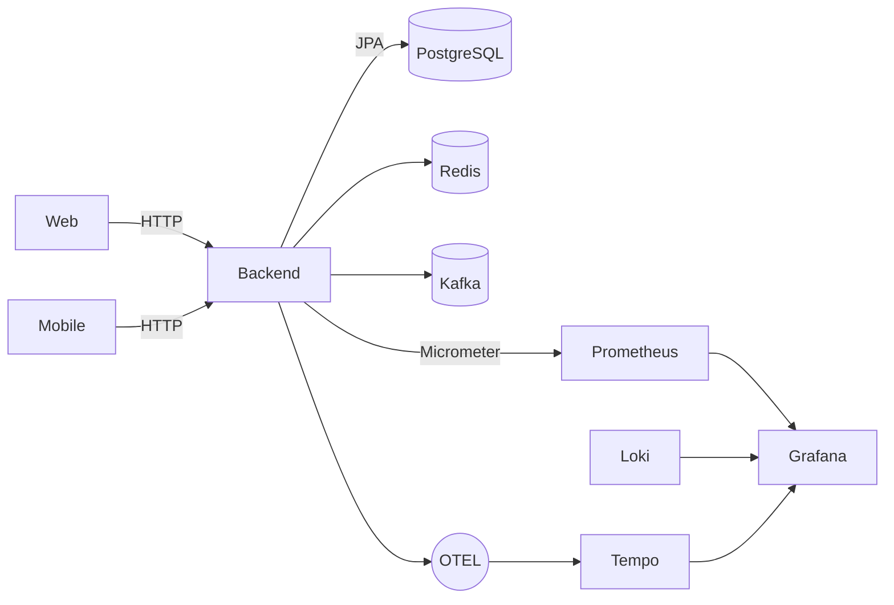

# Architecture

```mermaid
flowchart LR
  Web -->|HTTP| Backend
  Mobile -->|HTTP| Backend
  Backend -->|JPA| Postgres[(PostgreSQL)]
  Backend --> Redis[(Redis)]
  Backend --> Kafka[(Kafka)]
  Backend --> OTEL((OTEL))
  OTEL --> Tempo
  Backend -->|Micrometer| Prometheus
  Prometheus --> Grafana
  Loki --> Grafana
  Tempo --> Grafana
```
